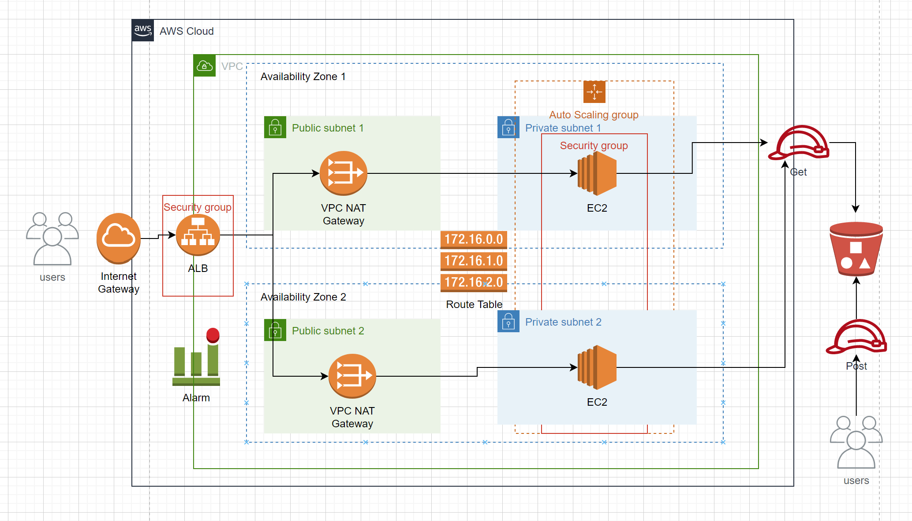
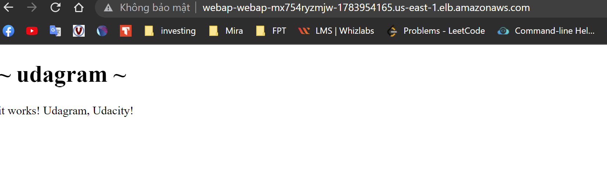

## Project Title - Deploy a high-availability web app using CloudFormation

Hello Udacity's mentor, my name is Thanh. In this project, we will deploy web servers for a highly available web app using CloudFormation. We will write the code that creates and deploys the infrastructure and application for an Instagram-like app from the ground up. We will begin with deploying the networking components, followed by servers, security roles and software. After the basic structure of network and servers are set up, we have additionally also set a cloudwatch alarm for notifying us when the total error rate exceeds 1. We have set up a SNS service to receive email in the scenario of this alarm getting triggered.

## Architecture

## URL Web app
http://webap-WebAp-MX754RYZMJW-1783954165.us-east-1.elb.amazonaws.com

